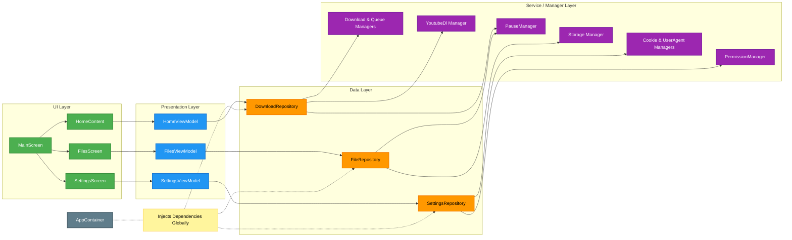

# Project Architecture & Design Principles

This document outlines the core architectural patterns, modularization strategy, and specific policies for handling web requests (User Agents and Cookies) in the VideoFetcher application.

## 1. Code Modularization & Layered Architecture

The application strictly adheres to a unidirectional, layered architecture designed to separate UI rendering from business logic and data persistence.

**The Flow:** `Screen (UI)` ➔ `ViewModel` ➔ `Repository` ➔ `Manager`

### Class Relationship Diagram

*   **Screens (UI Layer):** Built entirely with Jetpack Compose. Screens only observe state (via `StateFlow`) and dispatch user intents to ViewModels. They contain zero business logic.
*   **ViewModels (Presentation Layer):** Responsible for converting raw data flows from Repositories into UI-friendly states. They expose `StateFlow` variables (e.g., `videoInfoState`, `pausedDownloads`) and handle lifecycle-aware coroutines. 
*   **Repositories (Data Layer):** Act as intermediaries that aggregate data from one or more Managers. They abstract away the complexity of multiple data sources, providing a clean API for the ViewModels.
*   **Managers (Core Business/Service Layer):** The workhorses of the application. Each Manager has a single, well-defined responsibility (e.g., `DownloadManager`, `CookieManager`, `PauseManager`). They handle direct interactions with external libraries (yt-dlp, FFmpeg), the Android filesystem, and `SharedPreferences`/`DataStore`.

## 2. Custom Dependency Injection (DI)

To avoid memory leaks, lifecycle issues, and the rigidity of static singletons, the app implements a manual Dependency Injection (DI) system.

### `AppContainer`
*   **Responsibility:** The `AppContainer` is the central registry for the application. It is instantiated once at the `Application` level (`VideoFetcherApp.kt`).
*   **Class Naming & Instantiation:** It holds single instances of all `*Manager` and `*Repository` classes. Instead of classes instantiating their own dependencies (e.g., `val manager = PauseManager(context)`), they receive them via their constructors.
*   **Prevention of State Desync:** By ensuring all components reference the exact same Manager instances from the `AppContainer`, reactive streams (`StateFlow`) remain perfectly synchronized across the app (e.g., ensuring a paused download in a background service immediately reflects in the UI).

### `AppViewModelFactory`
*   **Responsibility:** Intercepts ViewModel creation to inject the necessary Repositories from the `AppContainer` directly into the ViewModel constructors.

## 3. User Agent (UA) Policies

The application employs dynamic User-Agent switching to optimize both user experience during manual login and yt-dlp's scraping reliability. This is governed by the `UserAgentManager`.

*   **Mobile UA (Default for Web Views):** When a user opens the In-App Browser to log into a platform, they are served a Mobile User-Agent. This ensures they receive a touch-friendly, responsive login screen.
*   **Desktop UA (Scraping Fallback):** For specific domains where mobile scraping is unreliable, the app switches to a Desktop User-Agent.
*   **Facebook Specifics:** Facebook is strictly hardcoded to use the `DESKTOP_USER_AGENT` for all yt-dlp scraping sessions (both authenticated and unauthenticated). This is because yt-dlp's extractors are optimized for parsing Facebook's desktop HTML structure.
*   **Persistence:** User-Agents are saved per-domain and backed up to a `.useragent/` folder in the user's custom storage directory via SAF (Storage Access Framework).

## 4. Cookie Management & Persistence

Handling authenticated sessions is critical for bypassing age restrictions, private video blocks, and bot-detection mechanics.

*   **Format:** Cookies are stored and exported in the standard **Netscape** format, which is natively understood by yt-dlp.
*   **Bi-Directional Syncing (`CookieManager`):** 
    1.  **Internal Storage:** Cookies are actively stored in the app's secure internal `filesDir` for rapid access by the yt-dlp engine.
    2.  **External Backup:** Cookies are simultaneously synced to a hidden `.cookies/` directory inside the user's chosen external Download folder. 
*   **User Control:** The bi-directional sync ensures that if the app is uninstalled or data is cleared, the user does not lose their authenticated sessions. Conversely, if a user manually drops a valid `cookies.txt` file into the `.cookies/` folder using a File Manager, the app will automatically ingest it on the next launch.
*   **Privacy:** Users are encouraged to minimize cookie usage (especially for Meta platforms) unless absolutely necessary, and can wipe domain-specific sessions directly from the app's UI.
